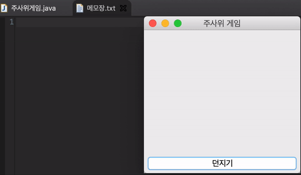
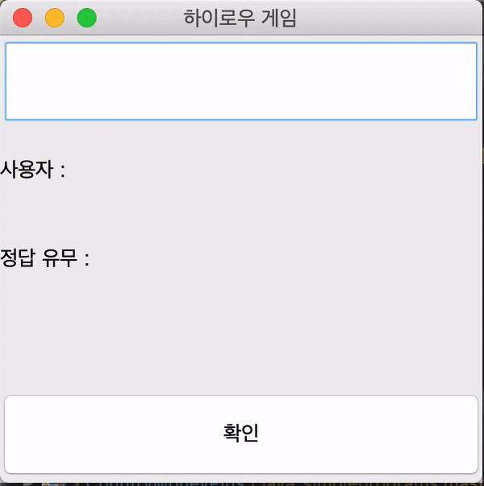
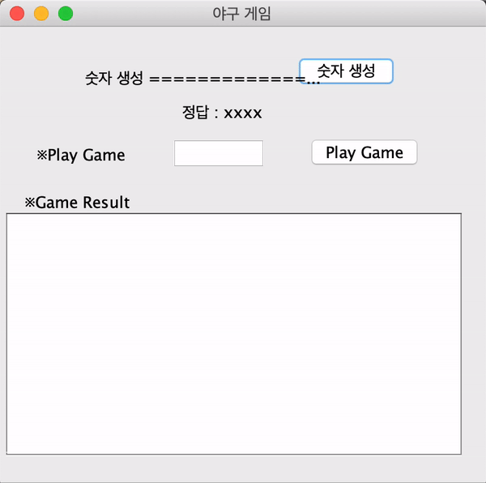
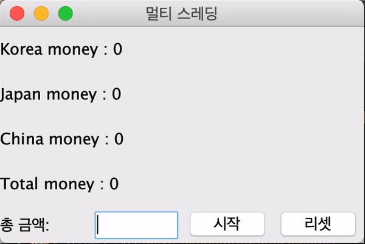
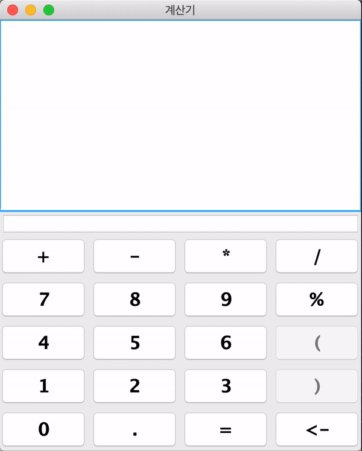
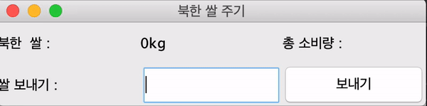
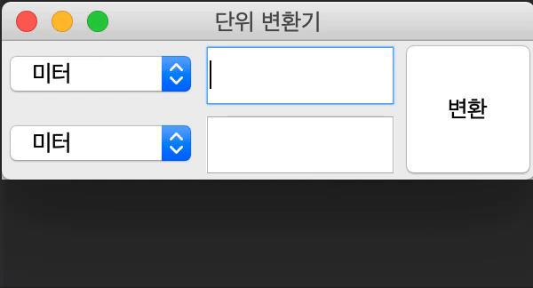
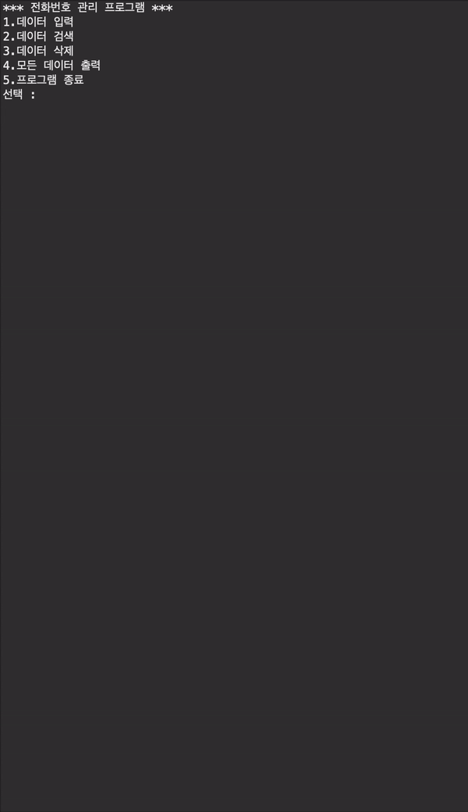
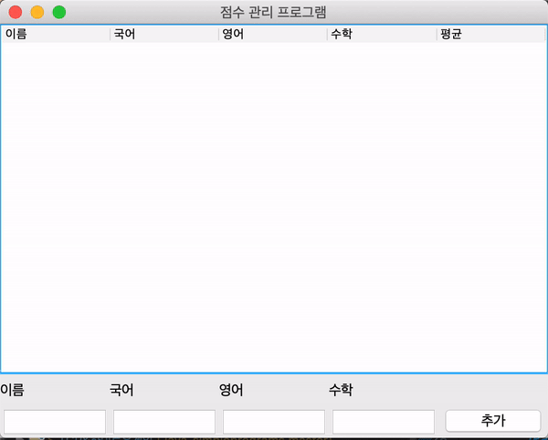

# 자바를 이용한 간단한 프로그램
2학년 1, 2학기 / 3학년 2학기 학교 JAVA 수업 실습 코드
  
 

### 주사위 게임

 

### 하이로우 게임

 

### 수강신청

 

### 야구게임

 

### 나라별 돈 나누기 (CountryMoneyPlus)

 

### 프레임 주고 받기 (Stop & Wait)

 

### 계산기

 

### 북한쌀주기 (UpgradeNorthKoreaGiveRice)

 

### 단위 변환기

 

### 핸드폰 정보 입력하기 (PhoneProject)

 

### 점수관리프로그램

